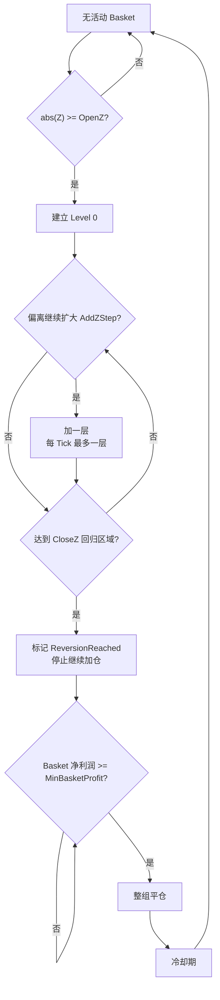

<<<<<<< HEAD
# PairBasket MT5 配对交易研究项目

> **状态：研究与验证阶段，不代表可直接实盘部署。**

这是一个面向 **MetaTrader 5 / MQL5** 的配对均值回归研究项目，当前交易对为 **NAS100 / US2000**。项目从早期 SMA-relative Spread 逐步演进到当前的 **rolling OLS log-price residual + Z-Score + Basket 阶梯加仓 + Basket 盈利退出** 框架，并配套了 MT5 参数优化、自定义风险指标、Score 以及时间切片验证流程。

## 当前基线

当前主代码：[`src/PairBasket_v10_6_OLS_M15_3Preset_2025_TimeSlice.mq5`](src/PairBasket_v10_6_OLS_M15_3Preset_2025_TimeSlice.mq5)

- Spread：rolling OLS residual
- 周期：M15
- `RegressionLookBack = 60`
- `Z LookBack = 60`
- `BaseLots = 0.01`
- `MaxAddCount = 7`
- `MaxAbsZ = 30`
- 正常退出：发生回归后，Basket 净利润达到 `MinBasketProfit=1` 才整体退出
- 当前研究只比较 A/B/C 三套固定预设，不再混搭 OpenZ/AddZ/LotStep

### 三套当前候选

| 版本 | OpenZ | CloseZ | AddZStep | MaxAdd | AddLotStep | 当前定位 |
|---|---:|---:|---:|---:|---:|---|
| **A** | 3.0 | 0.0 | 1.0 | 7 | 0.04 | 高收益 benchmark / regime 研究 |
| **B** | 4.5 | 1.0 | 2.0 | 7 | 0.03 | 当前更保守主候选 |
| **C** | 4.5 | 1.0 | 2.0 | 7 | 0.04 | 稍激进候选 |

## 策略核心

当前 OLS Spread 使用：

```text
y_t = log(NAS100_t)
x_t = log(US2000_t)
y_t = alpha_t + beta_t * x_t + epsilon_t
Spread_t = epsilon_t
Z_t = (Spread_t - Mean(Spread_history)) / Std(Spread_history)
```

交易方向：

- `Z >= +OpenZ`：SHORT spread = SELL NAS100 + BUY US2000
- `Z <= -OpenZ`：LONG spread = BUY NAS100 + SELL US2000
- 偏离继续扩大时，每隔 `AddZStep` 加一层
- Level N 手数：`BaseLots + N * AddLotStep`
- 达到回归阈值后停止加仓；Basket 净利润达标后整组退出



## 已完成的关键选参过程

项目并非直接从 A/B/C 开始，而是经过多轮缩圈：

1. **SMA vs OLS、M15/M30/H1 初筛**：OLS 在三个周期均盈利，后续主线切换到 OLS。
2. **v10.1：OLS M15/M30 约 120 组**：确认 M15 与 M30 的最优区不同，后续聚焦 M15。
3. **v10.4：M15 36 组**：发现两个明显区域：
   - 高收益峰：`Open3 / Add1 / LotStep0.04`
   - 高质量区域：`Open4.5 / Add2 / LotStep0.03~0.04`
4. **v10.5：A/B/C × MaxAdd(7/9/11) × CloseZ(0/0.5/1)**：
   - `MaxAdd=7` 已足够，9/11 没有改善风险收益。
   - A 保持 `CloseZ=0`。
   - B/C 使用 `CloseZ=1` 可显著缩短平均持仓，同时不明显恶化最大回撤。
5. **v10.6：固定三套预设，进入时间切片稳定性验证。**

详细过程见 [`docs/PROJECT_HANDOFF.md`](docs/PROJECT_HANDOFF.md)。

## 2024 / 2025 时间切片

> 这两年更准确地称为 **时间切片稳定性测试**，不能严格视为 OOS，因为参数筛选过程中已经接触过包含这些年份的历史数据。

| 年份 | 版本 | NetProfit | Sharpe | PF | Max DD | Worst Basket | 最长持仓 | 平均持仓 | Basket |
|---|---|---:|---:|---:|---:|---:|---:|---:|---:|
| 2025 | A | +4629.03 | 0.646 | 1.158 | 39.86% | 4769.82 | 106.0天 | 1.8天 | 149 |
| 2025 | B | +722.84 | 0.542 | 1.127 | 12.52% | 832.76 | 101.1天 | 2.9天 | 86 |
| 2025 | C | +875.09 | 0.527 | 1.127 | 15.79% | 997.30 | 101.1天 | 2.9天 | 86 |
| 2024 | A | **-5033.12** | **-0.784** | **0.237** | **61.00%** | **6124.47** | **360.6天** | **51.6天** | 7 |
| 2024 | B | +290.51 | 0.308 | 1.224 | 16.79% | 1704.77 | 115.9天 | 4.4天 | 61 |
| 2024 | C | +362.09 | 0.323 | 1.213 | 20.13% | 2050.87 | 115.7天 | 4.4天 | 61 |

当前判断：

- **A**：收益能力强，但 regime sensitivity 很高；2024 出现严重亏损和超长 Basket，暂不作为常驻主策略。
- **B**：目前更保守的主候选，2024/2025 都保持正收益，回撤和 Worst Basket 低于 C。
- **C**：收益略高于 B，但尾部风险也更高。
- **三个版本共同的核心未解决问题**：极端情况下 Basket 可持有 100 天以上；目前没有硬性 MaxBasketHoldDays / 硬止损。

原始结果见 [`results/timeslice/`](results/timeslice/)。

## 风险与重要口径变化

### 1. `MaxAbsZ` 曾从 10 提高到 30

v10.4 搜索阶段使用 `MaxAbsZ=10`；v10.5/v10.6 为了让 MaxAdd 7/9/11 的测试真正可达，将其提高到 30。因此：

> **v10.4 与 v10.5/v10.6 的回撤、Worst Basket 不能直接视为完全同口径。**

### 2. 当前没有硬止损 / 最大持仓期限

当前主要依赖：

- `MaxAddCount=7`
- `MaxAbsZ=30`
- 回归确认
- Basket 盈利退出

`InpMaxTotalBaseLots=0`、`InpMaxMarginUsagePct=0` 当前都表示禁用账户级限制。部署前必须补齐账户级风险预算。

### 3. OLS beta 仅用于信号，不用于仓位 hedge ratio

第二腿目前按当前价格名义金额匹配，不是按 OLS beta 配比。后续可单独研究 beta-neutral / dollar-neutral / volatility-neutral。

## 接手后的建议顺序

**不要先继续调参数。** 推荐：

1. 固定 A/B/C，跑 **2024-01-01 ~ 2025-12-31 连续两年**，观察跨年活动 Basket 如何收场。
2. 同参数跑 2023、2022（若券商历史数据可用）。
3. 建立明确的开发期 / 验证期 / 真正 OOS 期，避免继续在已看过的年份追峰值。
4. 优先研究尾部 Basket：
   - 持仓超过 15/30/45 天后禁止继续加仓；
   - 时间型退出/逐步放宽最低利润阈值；
   - 记录实际最大加仓层数分布；
   - 启用账户总手数 / 保证金使用上限。
5. 再做 LookBack 稳健性、交易成本压力、MaxAbsZ 敏感性、hedge ratio 和 regime filter。

完整路线图见 [`docs/ROADMAP.md`](docs/ROADMAP.md)。

## 仓库结构

```text
.
├── README.md
├── CHANGELOG.md
├── CONTRIBUTING.md
├── NOTICE.md
├── src/
│   ├── PairBasket_v10_6_OLS_M15_3Preset_2025_TimeSlice.mq5
│   └── archive/                  # 关键历史源码
├── docs/
│   ├── PROJECT_HANDOFF.md        # 最完整的项目交付文档 Markdown 版
│   ├── PairBasket_项目交付文档_2026-08-31.docx
│   ├── BACKTESTING_GUIDE.md
│   ├── ROADMAP.md
│   └── 历史说明文档...
├── results/
│   ├── timeslice/                # 2024 / 2025 A-B-C
│   └── optimization/             # 历次选参 CSV
└── tools/python/                 # v7 独立 Python 回测工具（非当前 v10.6 等价实现）
```

## MT5 快速复现

1. 将 `src/PairBasket_v10_6_OLS_M15_3Preset_2025_TimeSlice.mq5` 放入 `MQL5/Experts/`。
2. MetaEditor 编译，确认 `0 errors`。
3. Strategy Tester 选择该 EA。
4. 使用 M15 / OLS 固定版本；优化时仅枚举 `InpStrategyPreset` 的 A/B/C 三个值。
5. 用 **Slow complete algorithm / 完成优化** 即可，只有 3 个 Pass。
6. 时间切片期间不要重新调参数。
7. 自定义 CSV 写入 MT5 Common Files 目录。

更详细操作见 [`docs/BACKTESTING_GUIDE.md`](docs/BACKTESTING_GUIDE.md)。

## Score

当前 Score 用于优化筛选，而不是最终投资决策：

```text
若 NetProfit<=0 或 Sharpe<=0 或 PF<=1：返回负分
否则：
BaseScore = ReturnPct * Sharpe * (PF - 1) * 100
Score = BaseScore / (1 + MaxDDPct/10 + WorstBasketLossPct/10)
```

同时会处罚：最长 Basket >30天、测试结束活动 Basket >7天、极端 Z 连续 >24h、Basket 样本数 <30。

Score 不直接奖励资金周转，因此必须与 NetProfit、Sharpe、PF、MaxDD、Worst Basket、最长/平均持仓一起看。

## Python 工具说明

`tools/python/` 中保留的是早期 v7 独立回测器，用于研究和交叉验证，但它**不是当前 v10.6 OLS 三预设策略的完全等价实现**。不要用该 Python 脚本替代 MT5 v10.6 结果，除非先同步逻辑。

## 免责声明

本仓库用于策略研究、回测和工程验证，不构成投资建议，也不保证未来收益。历史回测结果可能受到数据质量、券商合约规格、点差、滑点、手续费、交易时段和参数过拟合影响。

# pairbasket-mt5-ols
>>>>>>> origin/main
