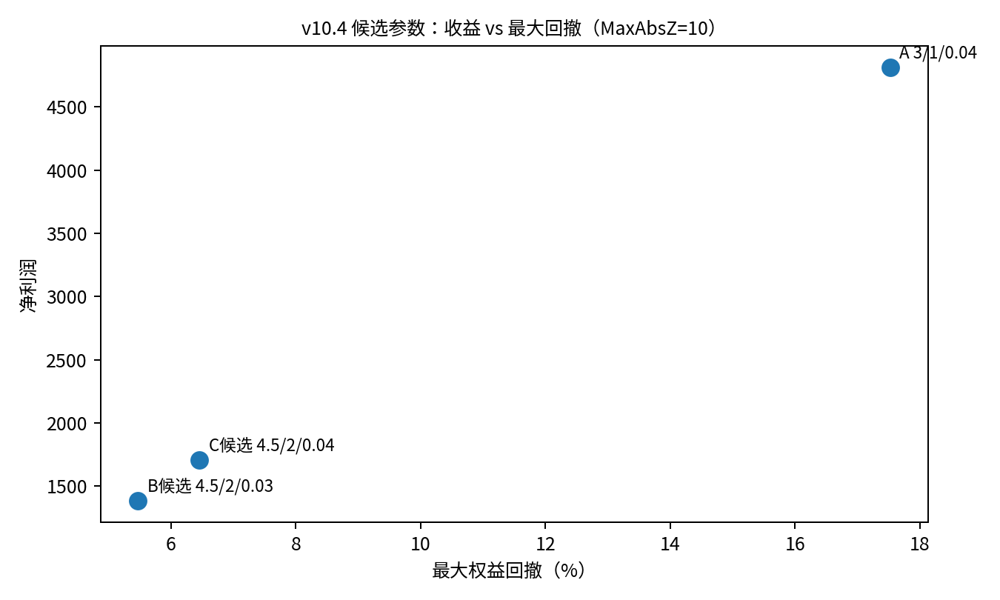
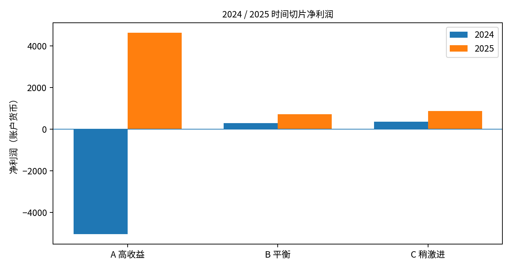
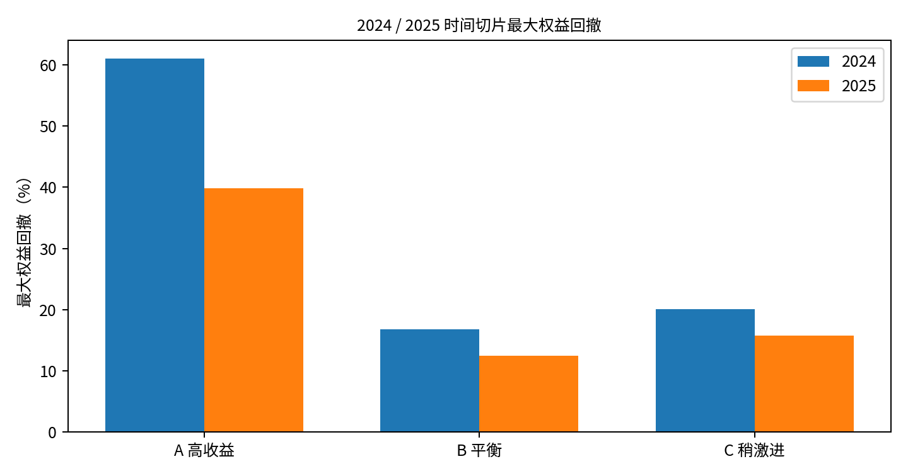

**PairBasket 配对交易项目**

**研发与回测交付文档**

当前基线：v10.6 / OLS Residual / M15 / A-B-C 三预设时间切片验证

| **交付日期**   | 2026-08-31                                          |
|----------------|-----------------------------------------------------|
| **当前主代码** | PairBasket_v10_6_OLS_M15_3Preset_2025_TimeSlice.mq5 |
| **交易标的**   | NAS100 / US2000                                     |
| **项目阶段**   | 研究与验证阶段（尚未判定可直接实盘部署）            |
| **本文件用途** | 让后续同事无需阅读完整聊天记录即可接手              |

<table>
<colgroup>
<col style="width: 100%" />
</colgroup>
<thead>
<tr class="header">
<th>
<strong>交付结论</strong>

当前建议把 B（4.5 / Close1 / AddZ2 / MaxAdd7 /
LotStep0.03）作为更保守主候选，C（同参数但
LotStep0.04）作为稍激进候选；A（3 / Close0 / AddZ1 / MaxAdd7 /
LotStep0.04）保留为高收益 benchmark / 市场状态研究版本。2024、2025
单年切片显示 A 的行情依赖非常强，而 B/C 两年均保持正收益。下一步优先做
2024-2025 连续两年测试，再补 2023/2022，同一阶段不要再调参数。
</th>
</tr>
</thead>
<tbody>
</tbody>
</table>

# **0. 接手人先看这一页**

<table>
<colgroup>
<col style="width: 100%" />
</colgroup>
<thead>
<tr class="header">
<th>
<strong>当前工作状态</strong>

策略主体已经完成：统一 Z 方向、Basket 状态机、线性阶梯加仓、回归后
Basket 盈利平仓、OLS residual Spread、优化风险指标与综合
Score、三套策略预设和时间切片输出。当前工作重点已经从“继续找最大利润参数”转为“验证跨年份稳定性和尾部
Basket 风险”。
</th>
</tr>
</thead>
<tbody>
</tbody>
</table>

| **项目**             | **当前值/结论**                                              |
|----------------------|--------------------------------------------------------------|
| **当前源码**         | PairBasket_v10_6_OLS_M15_3Preset_2025_TimeSlice.mq5          |
| **Spread**           | 固定 OLS log-price residual                                  |
| **周期**             | 固定 M15                                                     |
| **回归/Z窗口**       | RegressionLookBack=60；Z LookBack=60                         |
| **A**                | Open3 / Close0 / AddZ1 / MaxAdd7 / LotStep0.04               |
| **B**                | Open4.5 / Close1 / AddZ2 / MaxAdd7 / LotStep0.03             |
| **C**                | Open4.5 / Close1 / AddZ2 / MaxAdd7 / LotStep0.04             |
| **当前已完成切片**   | 2024、2025                                                   |
| **下一步第一优先级** | 2024-01-01～2025-12-31 连续回测；随后 2023、2022 单年切片    |
| **最大结构性风险**   | 少数 Basket 持仓可超过 100 天；当前没有硬性最大持仓退出/止损 |

特别注意：v10.4 搜索阶段的 InpMaxAbsZ=10，而 v10.5/v10.6
为了测试更多加仓层将 InpMaxAbsZ 提高到 30。因此 v10.4
与当前版本的回撤/Worst Basket
不能直接当成完全同口径结果。这个变化是项目交接时最容易忽略的风险点。

## **接手后建议按这个顺序做**

1\. 不要先改参数。用 v10.6 原样跑 2024-01-01～2025-12-31
连续两年，观察跨年未平仓 Basket 如何收场。

2\. 再分别跑 2023、2022（如历史数据可用），保持 A/B/C 参数不变。

3\. 把每个时间片的 CSV
汇总到同一张年度稳定性表：NetProfit、Sharpe、PF、Max DD、Worst
Basket、最长/平均持仓、Basket 数、ActiveBasketAgeAtEnd。

4\. 确认稳定性之后，再研究最大持仓期限/尾部风险控制，而不是继续细调
OpenZ/AddZ/LotStep。

5\. 后续如要重新寻优，必须把开发区间和真正 OOS
区间分开，避免把已经看过的 2024/2025 继续当“样本外”。

# **目录与文档范围**

1\. 项目目标与策略定位

2\. 当前策略与代码机制

3\. 版本演进与关键决策

4\. 选参过程与回测证据

5\. 当前三套方案及时间切片结果

6\. 当前源码参数与函数地图

7\. MT5 回测/优化操作与结果文件

8\. 已知风险、限制与注意事项

9\. 后续优化路线与优先级

10\. 交付资料清单与接手检查表

附录 A：Score 与指标定义

附录 B：当前参数配置表

说明：本文档以当前会话内的 MQ5 源码、CSV
回测结果和已生成说明文档为依据。对于“下一步建议”类内容，会明确以建议/推断表述，不把尚未验证的结论写成事实。

# **1. 项目目标与策略定位**

项目目标是为 NAS100 与 US2000 构建一套可在 MT5
中运行和批量回测的配对均值回归 EA：使用统计 Spread 识别相对偏离，按
Z-Score 的方向做多/做空
Pair；当偏离继续扩大时分层加仓；行情回归后，只有整个 Basket
达到最低盈利条件才统一退出。

项目从原始 v6.1 的单次开仓/简单回归退出逐步演化到当前
v10.6。当前不再把“净利润最大”作为唯一目标，而是同时关注 Sharpe、Profit
Factor、最大权益回撤、单 Basket 最大浮亏、最长/平均持仓、极端 Z
持续时间和测试末尾未解决 Basket。

<table>
<colgroup>
<col style="width: 100%" />
</colgroup>
<thead>
<tr class="header">
<th>
<strong>当前定位</strong>

这是一个研究/验证阶段的量化策略工程，不应仅凭现有优化结果直接认定可实盘。尤其需要继续验证跨年份稳定性、交易成本敏感性和长尾
Basket 风险。
</th>
</tr>
</thead>
<tbody>
</tbody>
</table>

## **1.1 当前交易对象与默认账户口径**

| **参数**                        | **当前默认值** | **说明**                               |
|---------------------------------|----------------|----------------------------------------|
| Symbol1                         | NAS100         | 品种1；Pair SHORT 时卖出               |
| Symbol2                         | US2000         | 品种2；Pair SHORT 时买入               |
| TradeMode                       | MODE_BOTH      | 同时交易两条腿                         |
| BaseLots                        | 0.01           | Level 0 基础手数                       |
| Symbol1LotSize / Symbol2LotSize | 1.0 / 1.0      | 名义金额配比参数；需按实际券商合约核对 |
| MagicNumber                     | 20260217       | 识别本 EA 订单/持仓                    |

# **2. 当前策略与代码机制**

## **2.1 Spread：当前固定 rolling OLS log residual**

当前 v10.6 运行阶段固定使用 OLS residual，不再测试 SMA
Relative。回归模型：

<table>
<colgroup>
<col style="width: 100%" />
</colgroup>
<thead>
<tr class="header">
<th>y_t = log(NAS100_t) 
x_t = log(US2000_t) 
y_t = alpha_t + beta_t * x_t + epsilon_t 
Spread_t = epsilon_t</th>
</tr>
</thead>
<tbody>
</tbody>
</table>

alpha/beta 使用前 60 根已完成 M15 K 线拟合；当前 bar 不参与 OLS
拟合，只用于计算当前 residual，从而避免当前未完成 bar
反向影响回归系数。随后将 residual 放入 Spread 历史，再用 60 根历史
Spread 计算 Z-Score。

| Z_t = (Spread_t - Mean(Spread_history)) / Std(Spread_history) |
|---------------------------------------------------------------|

OLS beta 当前只用于生成交易信号。实际两腿手数并不是按 beta
做回归对冲，而是按两品种当前名义金额近似匹配；这是后续可以单独研究的一项改进。

## **2.2 方向定义已统一为 Z-Score 正负**

| **条件**     | **Pair方向** | **Symbol1** | **Symbol2** |
|--------------|--------------|-------------|-------------|
| Z \>= +OpenZ | SHORT_SPREAD | SELL        | BUY         |
| Z \<= -OpenZ | LONG_SPREAD  | BUY         | SELL        |

这个统一发生在 v7 阶段，解决了原版“开仓阈值看 Z、交易方向却看 logSpread
正负”可能不一致的问题。当前首仓、加仓、回归和平仓全部围绕同一个 Z
方向状态机。

## **2.3 Basket 生命周期**

<table>
<colgroup>
<col style="width: 100%" />
</colgroup>
<thead>
<tr class="header">
<th>无 Basket 
-&gt; |Z| 达到 OpenZ：建立 Level 0 
-&gt; 偏离继续扩大：每隔 AddZStep 加一层（每 Tick 最多一层） 
-&gt; Z 到达 CloseZ 对应回归区域：ReversionReached =
true，停止继续加仓 
-&gt; Basket 净利润 &gt;= MinBasketProfit：整组退出 
-&gt; 全部腿确认关闭：重置 Basket -&gt; 冷却期</th>
</tr>
</thead>
<tbody>
</tbody>
</table>

关键点：触及回归阈值并不等于立刻平仓。当前默认
RequireProfitClose=true，MinBasketProfit=1，因此只有“已经发生回归”且
Basket 整体净盈利达到 1 个账户货币单位后才退出。

## **2.4 阶梯加仓与线性手数**

加仓锚点使用“上一次实际成功加仓时的
Z”，不是固定绝对档位。若价格一次跳过多个 Z 档位，一个 Tick
仍最多只增加一层，避免跳空时瞬间打满全部仓位。

<table>
<colgroup>
<col style="width: 100%" />
</colgroup>
<thead>
<tr class="header">
<th>Level 0 lots = BaseLots 
Level N lots = BaseLots + N * AddLotStep</th>
</tr>
</thead>
<tbody>
</tbody>
</table>

当前 BaseLots=0.01。A/C 的 AddLotStep=0.04，B=0.03。MaxAddCount 固定
7。v10.6 的 MaxAbsZ=30，只有当 \|Z\|\>=30 才停止继续加仓；与 v10.4 的
MaxAbsZ=10 不同。

## **2.5 两腿配比、成交与失败回滚**

BOTH 模式先下 Symbol1。若 Symbol1 部分成交，程序用实际成交量重新计算
Symbol2 目标手数，使两腿名义金额尽量匹配：

<table>
<colgroup>
<col style="width: 100%" />
</colgroup>
<thead>
<tr class="header">
<th>Symbol1Notional = Symbol1Lots * Symbol1LotSize * Price1 
Symbol2Lots = Symbol1Notional / (Symbol2LotSize * Price2)</th>
</tr>
</thead>
<tbody>
</tbody>
</table>

若第二腿失败或部分成交，本层新增仓位会整体回滚，只回滚当前
Level，不影响历史已经建立的层。这个设计是多层 Pair 必须保留的执行保护。

## **2.6 平仓、日内逻辑与冷却期**

- 正常退出：先触发回归，再要求 Basket 净利润 \>= 1。

- 触发回归后 g_reversionReached=true，本 Basket 不再继续加仓。

- 日内 23:00 GMT 的清仓逻辑默认也要求“已回归 + Basket
  盈利”，因此不是硬性日终止损。

- 整个 Basket 成功关闭后进入 60 分钟冷却期。

- 智能平仓按品种汇总全部 Position 的盈亏来决定先平哪一腿，适配多层仓位。

## **2.7 状态恢复与测试器隔离**

生产/普通运行中，Basket 方向、首仓 Z、上次加仓
Z、加仓次数、回归状态、Basket 开始时间、冷却期等通过 MT5 Terminal Global
Variables 保存，支持 EA/终端重启后恢复。

策略测试器环境中不使用这些终端全局变量，避免不同优化 Pass
之间互相污染。这一点对 MT5 批量优化非常重要。

# **3. 版本演进与关键决策**

| **版本/阶段**  | **主要变化**                                                                             | **形成的决定**                                             |
|----------------|------------------------------------------------------------------------------------------|------------------------------------------------------------|
| **v6.1 原版**  | SMA-relative Spread；开仓/方向逻辑存在基准不一致；单层思路                               | 作为起点，后续不再直接使用                                 |
| **v7.0**       | 统一 Z 方向；Basket 状态机；连续偏离加仓；回归后盈利平仓；失败回滚；重启恢复             | 解决多层仓位管理与尾部退出逻辑                             |
| **Python v7**  | 本地 CSV 回测脚本，复刻 v7 bar/tick-like 执行顺序                                        | 保留作独立研究工具；当前主线仍是 MT5                       |
| **v9.1**       | 把指数/倍增加仓改为线性加仓；增加 M15/M30/H1 可优化枚举                                  | 确定线性 AddLotStep 表达方式                               |
| **v10.0**      | 加入 rolling OLS residual Spread；输出 MaxDD、WorstBasket、持仓时间、ExtremeZ、Sharpe 等 | 开始从“利润”转向综合风险收益评估                           |
| **v10.1**      | 固定 OLS 后做 M15/M30 网格；加入综合 Score                                               | 发现 M15 与 M30 最优区完全不同，后续主攻 M15               |
| **v10.4**      | M15 36 组：OpenZ 3~4.5、AddZ 1~2、LotStep .02~.04                                        | 发现 4.5/2.0/.03~.04 高质量区域，同时保留 3/1/.04 高收益峰 |
| **v10.5**      | A/B/C 三版本 × MaxAdd 7/9/11 × CloseZ 0/.5/1 = 27 组；MaxAbsZ 提至30                     | 确定 MaxAdd=7；A Close0，B/C Close1                        |
| **v10.6 当前** | 固定 OLS + M15，仅枚举 A/B/C 三预设，专用于时间切片                                      | 已完成 2024/2025；下一步连续跨年与更多年份                 |

## **3.1 一个必须保留在交接里的口径变化：MaxAbsZ 10 -\> 30**

<table>
<colgroup>
<col style="width: 100%" />
</colgroup>
<thead>
<tr class="header">
<th>
<strong>为什么重要</strong>

v10.4 的 36 组搜索使用 InpMaxAbsZ=10；v10.5 为了测试
MaxAddCount=7/9/11，若仍停在 |Z|=10，很多高层加仓根本不会发生，因此把
MaxAbsZ 提到 30。v10.6 沿用
30。这个变化会显著改变可达到的风险暴露，所以不能把 v10.4
的低回撤指标直接当作当前 v10.6 同参数的预期。
</th>
</tr>
</thead>
<tbody>
</tbody>
</table>

# **4. 选参过程与回测证据**

## **4.1 第一步：Spread 模型与周期筛选（6 组）**

| **Spread**   | **周期** | **净利润** | **Sharpe** | **PF** | **MaxDD** | **Worst Basket** | **最长持仓**     | **平均持仓**   | **Max极端Z** |
|--------------|----------|------------|------------|--------|-----------|------------------|------------------|----------------|--------------|
| OLS residual | H1       | 354.76     | 0.329      | 1.134  | 10.65%    | 1054.19          | 2303.9h / 96.0天 | 160.9h / 6.7天 | 3.86         |
| OLS residual | M15      | 1703.05    | 0.577      | 1.195  | 25.87%    | 2654.44          | 1424.7h / 59.4天 | 38.7h / 1.6天  | 1.21         |
| OLS residual | M30      | 439.76     | 0.468      | 1.139  | 10.10%    | 1059.57          | 1532.6h / 63.9天 | 80.1h / 3.3天  | 2.94         |
| SMA relative | H1       | -277.55    | -0.124     | 0.937  | 21.93%    | 2393.99          | 1543.5h / 64.3天 | 114.3h / 4.8天 | 49.66        |
| SMA relative | M15      | 314.40     | 0.199      | 1.050  | 16.64%    | 1825.20          | 1534.0h / 63.9天 | 57.8h / 2.4天  | 49.01        |
| SMA relative | M30      | 575.40     | 0.496      | 1.131  | 13.89%    | 1513.86          | 1543.5h / 64.3天 | 51.0h / 2.1天  | 2.70         |

关键观察：OLS 在 M15/M30/H1 三个周期全部为正收益，而 SMA Relative 在 H1
为负；OLS M15 的净利润/Sharpe/PF 在该轮最好。更重要的是，SMA M15 的
MaxExtremeZHours 约 49 小时，而 OLS M15 约 1.21 小时，这支持 residual
更像短期均值回归残差的研究假设。M30/H1
则出现更长持仓和测试末尾尾仓。基于效率和表现，后续逐步收敛到 OLS + M15。

## **4.2 第二步：v10.1 OLS 网格（120 组）**

搜索空间：TimeFrame=M15/M30；OpenZ=1.5/2.0/2.5/3.0；AddZ=1/1.5/2/2.5/3；AddLotStep=0/0.02/0.04；LookBack
和 RegressionLookBack 均固定 60，MaxAdd=7。

| **定位**     | **参数**         | **净利润** | **Sharpe** | **PF** | **MaxDD** | **Worst Basket** | **最长持仓**     | **平均持仓**  | **Score** |
|--------------|------------------|------------|------------|--------|-----------|------------------|------------------|---------------|-----------|
| 收益最高     | M15/3/1/0.04     | 4813.27    | 1.624      | 1.383  | 17.53%    | 2342.38          | 1128.1h / 47.0天 | 40.9h / 1.7天 | 375.4     |
| 高收益降风险 | M15/3/1/0.02     | 2809.73    | 1.653      | 1.361  | 11.08%    | 1320.37          | 1128.1h / 47.0天 | 41.0h / 1.7天 | 312.4     |
| 激进平衡     | M15/3/2/0.04     | 1691.15    | 1.772      | 1.363  | 6.89%     | 760.27           | 1128.1h / 47.0天 | 41.9h / 1.7天 | 283.4     |
| 当时平衡首选 | M15/3/2/0.02     | 1120.34    | 1.786      | 1.340  | 4.84%     | 514.73           | 1128.1h / 47.0天 | 41.9h / 1.7天 | 217.3     |
| 保守基线     | M15/3/2/0.00     | 571.95     | 1.729      | 1.301  | 2.56%     | 260.07           | 1128.1h / 47.0天 | 44.4h / 1.8天 | 125.1     |
| M30候选      | M30/1.5/1.5/0.00 | 564.08     | 1.574      | 1.261  | 2.43%     | 241.25           | 1424.6h / 59.4天 | 63.5h / 2.6天 | 67.7      |

- M15 的 OpenZ=3.0 明显优于较低阈值，而且 3.0 正好撞到搜索上边界 -\>
  继续向 3.5/4/4.5 外扩。

- M15 稳定的 AddZ 区域更接近 2.0~2.5；AddZ=1
  可以做出高利润尖峰，但尾部风险更大。

- M30 最佳反而出现在 OpenZ=1.5 的下边界，且偏好等手数；说明 M15/M30
  不是同一套最优逻辑。为了提高效率，后续先暂停 M30。

## **4.3 第三步：v10.4 M15 边界外扩（36 组）**

固定
OLS/M15；OpenZ=3/3.5/4/4.5；AddZ=1/1.5/2；AddLotStep=0.02/0.03/0.04。该阶段
MaxAbsZ=10。

| **定位**          | **Open/Add/Lot** | **净利润** | **Sharpe** | **PF** | **MaxDD** | **Worst Basket** | **最长持仓**     | **平均持仓**  | **Score** |
|-------------------|------------------|------------|------------|--------|-----------|------------------|------------------|---------------|-----------|
| A 高收益峰        | 3/1/0.04         | 4813.27    | 1.624      | 1.383  | 17.53%    | 2342.38          | 1128.1h / 47.0天 | 40.9h / 1.7天 | 375.4     |
| A邻域             | 3/1/0.03         | 3814.85    | 1.642      | 1.376  | 14.47%    | 1830.25          | 1128.1h / 47.0天 | 40.9h / 1.7天 | 351.8     |
| B候选             | 4.5/2/0.03       | 1385.02    | 2.241      | 1.534  | 5.47%     | 561.81           | 920.3h / 38.3天  | 44.4h / 1.8天 | 615.0     |
| C候选             | 4.5/2/0.04       | 1704.91    | 2.299      | 1.570  | 6.45%     | 671.92           | 920.3h / 38.3天  | 43.7h / 1.8天 | 753.6     |
| 4.5密集加仓高收益 | 4.5/1/0.04       | 3840.69    | 1.246      | 1.423  | 28.01%    | 3108.93          | 920.3h / 38.3天  | 43.3h / 1.8天 | 229.0     |

这一步发现两个不同的“峰”：A=3/1/0.04 是绝对收益峰；4.5/2/0.03~0.04
则是高 Sharpe、高 PF、低回撤的风险收益峰。B/C 同时表现好，说明 4.5/2
附近并非单点尖峰。

图 1 v10.4 三个核心候选的收益/回撤位置（注意：该阶段 MaxAbsZ=10）

## **4.4 第四步：v10.5 MaxAdd 与提前回归平仓（27 组）**

将 A/B/C 固定成策略预设，只测试 MaxAddCount=7/9/11 与
CloseZ=0/0.5/1。为了让 9/11 层真的有机会发生，这一阶段 MaxAbsZ 从 10
提到 30。

| **版本** | **CloseZ** | **净利润** | **Sharpe** | **PF** | **MaxDD** | **Worst** | **最长**         | **平均**      | **Basket** | **Score** |
|----------|------------|------------|------------|--------|-----------|-----------|------------------|---------------|------------|-----------|
| A        | 0.0        | 4840.60    | 1.635      | 1.385  | 17.49%    | 2342.38   | 1128.1h / 47.0天 | 40.9h / 1.7天 | 97         | 382.3     |
| A        | 0.5        | 4889.07    | 1.483      | 1.315  | 20.18%    | 2430.37   | 1128.1h / 47.0天 | 25.6h / 1.1天 | 136        | 267.6     |
| A        | 1.0        | 1561.43    | 0.274      | 1.124  | 46.42%    | 4883.51   | 1424.7h / 59.4天 | 49.8h / 2.1天 | 84         | 2.6       |
| B        | 0.0        | 1431.60    | 1.367      | 1.435  | 13.22%    | 1473.55   | 920.3h / 38.3天  | 43.8h / 1.8天 | 68         | 175.4     |
| B        | 0.5        | 1341.48    | 1.316      | 1.378  | 13.30%    | 1473.55   | 920.3h / 38.3天  | 40.0h / 1.7天 | 73         | 137.2     |
| B        | 1.0        | 1476.52    | 1.636      | 1.341  | 13.12%    | 1473.55   | 920.3h / 38.3天  | 25.1h / 1.0天 | 97         | 170.0     |
| C        | 0.0        | 1767.26    | 1.346      | 1.448  | 16.30%    | 1866.20   | 920.3h / 38.3天  | 43.1h / 1.8天 | 69         | 185.4     |
| C        | 0.5        | 1663.45    | 1.299      | 1.391  | 16.42%    | 1866.20   | 920.3h / 38.3天  | 39.5h / 1.6天 | 74         | 146.7     |
| C        | 1.0        | 1813.38    | 1.590      | 1.343  | 16.17%    | 1866.20   | 920.3h / 38.3天  | 24.8h / 1.0天 | 98         | 172.4     |

- MaxAdd 7/9/11：B/C 在所有 CloseZ 下结果完全相同；A
  大多数也相同。唯一明显差异在 A+Close0.5，9/11 仅多一点利润，却提高
  DD/Worst Basket。因此 MaxAdd=7 足够。

- A：Close0 综合最好；Close0.5 提高周转但风险质量下降；Close1
  显著恶化（Sharpe 0.274、DD 46.4%）。

- B/C：Close1 把平均持仓从约 43h 压到约 25h，同时提高 Sharpe
  和净利润，且最长持仓没有改善。因此 Close1 主要优化普通 Basket
  周转，不解决尾部 Basket。

# **5. 当前三套方案及时间切片结果**

## **5.1 当前 v10.6 固定的三套方案**

| **版本**   | **OpenZ** | **CloseZ** | **AddZ** | **MaxAdd** | **LotStep** | **当前用途**                   |
|------------|-----------|------------|----------|------------|-------------|--------------------------------|
| A 高收益型 | 3.0       | 0.0        | 1.0      | 7          | 0.04        | 高收益 benchmark；行情状态敏感 |
| B 平衡型   | 4.5       | 1.0        | 2.0      | 7          | 0.03        | 当前更保守主候选               |
| C 稍激进型 | 4.5       | 1.0        | 2.0      | 7          | 0.04        | 收益高于B，风险也更高          |

注意：当前三套方案均在 MaxAbsZ=30 的 v10.6 代码上运行。B/C
的“高质量”标签来自先前搜索过程，但在 MaxAbsZ 变化后，风险水平与 v10.4 的
MaxAbsZ=10 结果不同；评价必须以当前时间切片/当前版本为准。

## **5.2 2025 单年切片**

| **版本** | **净利润** | **Sharpe** | **PF** | **MaxDD** | **Worst Basket** | **最长持仓**      | **平均持仓**  | **Basket** | **末尾活动Basket** | **Score** |
|----------|------------|------------|--------|-----------|------------------|-------------------|---------------|------------|--------------------|-----------|
| A        | 4629.03    | 0.646      | 1.158  | 39.86%    | 4769.82          | 2544.1h / 106.0天 | 43.7h / 1.8天 | 149        | 175.1h / 7.3天     | 5.94      |
| B        | 722.84     | 0.542      | 1.127  | 12.52%    | 832.76           | 2426.4h / 101.1天 | 69.5h / 2.9天 | 86         | 655.9h / 27.3天    | 0.55      |
| C        | 875.09     | 0.527      | 1.127  | 15.79%    | 997.30           | 2426.4h / 101.1天 | 69.5h / 2.9天 | 86         | 655.9h / 27.3天    | 0.56      |

2025 的 A 收益极高（+4629），但最大回撤接近 40%、Worst Basket 约
4769；B/C 收益较低但风险显著更小。三个版本都出现了很长的尾部持仓：B/C
最长约 101 天，A 最长约 106 天。

## **5.3 2024 单年切片**

| **版本** | **净利润** | **Sharpe** | **PF** | **MaxDD** | **Worst Basket** | **最长持仓**      | **平均持仓**     | **Basket** | **末尾活动Basket** | **Score** |
|----------|------------|------------|--------|-----------|------------------|-------------------|------------------|------------|--------------------|-----------|
| A        | -5033.12   | -0.784     | 0.237  | 61.00%    | 6124.47          | 8653.5h / 360.6天 | 1238.0h / 51.6天 | 7          | 8653.5h / 360.6天  | -172.58   |
| B        | 290.51     | 0.308      | 1.224  | 16.79%    | 1704.77          | 2781.9h / 115.9天 | 105.9h / 4.4天   | 61         | 463.3h / 19.3天    | 0.43      |
| C        | 362.09     | 0.323      | 1.213  | 20.13%    | 2050.87          | 2776.4h / 115.7天 | 105.5h / 4.4天   | 61         | 463.3h / 19.3天    | 0.46      |

2024 是关键反例：A 净亏 -5033、Sharpe -0.784、PF 0.237、MaxDD
61%，且一个 Basket 几乎贯穿全年（最长/末尾活动均约 360.6
天），全年仅观察到 7 个 Basket。B/C 则仍保持正收益，说明高 OpenZ/宽 AddZ
的结构具有更好的跨状态存活性，但 Sharpe 仍不高。

|                                   |                                   |
|-----------------------------------------------------------------------------|-----------------------------------------------------------------------------|

图 2-3 2024/2025 三版本净利润与最大回撤

## **5.4 当前评估结论**

| **版本**     | **当前评级**       | **理由**                                           | **不确定性/风险**                                            |
|--------------|--------------------|----------------------------------------------------|--------------------------------------------------------------|
| **A 高收益** | 研究型 / benchmark | 适合均值回归环境时收益能力强；2025 +4629           | 2024 -5033、DD61%；明显 regime sensitivity；不建议常驻主策略 |
| **B 平衡**   | 当前更保守主候选   | 2024/2025 都盈利；两年最差 DD 低于 C；LotStep 更小 | Sharpe 单年仅约0.31~0.54；仍有100天级最长持仓                |
| **C 稍激进** | 第二候选           | 两年收益均高于 B，仍保持正收益                     | 回撤/Worst Basket 均高于 B；同样存在长尾持仓                 |

<table>
<colgroup>
<col style="width: 100%" />
</colgroup>
<thead>
<tr class="header">
<th>
<strong>不要把 2024/2025 称为严格 OOS</strong>

A/B/C
参数是在更长历史区间的多轮优化中筛出来的，当前这两个年份至少部分已经参与过前期选参。因此目前更准确的名称是“时间切片稳定性测试”。真正的样本外验证需要用未参与任何选参的后续区间，或重新做明确的开发期/验证期/测试期划分。
</th>
</tr>
</thead>
<tbody>
</tbody>
</table>

# **6. 当前源码参数与函数地图**

## **6.1 当前主代码**

文件：PairBasket_v10_6_OLS_M15_3Preset_2025_TimeSlice.mq5（#property
version 10.6）。代码在 OnTesterInit() 中强制固定 OLS + M15，只枚举
InpStrategyPreset=0/1/2，因此时间切片时每个区间只有 3 个 Pass。

## **6.2 关键默认输入**

| **输入**                        | **当前值**       | **说明**                        |
|---------------------------------|------------------|---------------------------------|
| **InpSymbol1**                  | NAS100           | 品种1                           |
| **InpSymbol2**                  | US2000           | 品种2                           |
| **InpTimeFrame**                | M15              | 测试阶段固定                    |
| **InpSpreadModel**              | OLS_LOG_RESIDUAL | 测试阶段固定                    |
| **InpRegressionLookBack**       | 60               | OLS窗口                         |
| **InpLookBack**                 | 60               | Z窗口                           |
| **InpTradeMode**                | MODE_BOTH        | 双腿                            |
| **InpEnableScaleIn**            | true             | 启用阶梯加仓                    |
| **InpMinAddIntervalSec**        | 60               | 两层最短间隔秒                  |
| **InpMaxAbsZ**                  | 30               | 当前版本风险边界                |
| **InpMaxTotalBaseLots**         | 0                | 禁用总手数上限                  |
| **InpMaxMarginUsagePct**        | 0                | 禁用保证金比例上限              |
| **InpRequireProfitClose**       | true             | 需要Basket盈利                  |
| **InpMinBasketProfit**          | 1.0              | 账户货币                        |
| **InpEndOfDayRequireReversion** | true             | EOD也要求回归                   |
| **InpLots**                     | 0.01             | 基础手数                        |
| **InpCoolDownMinutes**          | 60               | Basket后冷却                    |
| **InpEarliestHour/LatestHour**  | 1 / 22 GMT       | 可开仓/加仓时段                 |
| **InpCloseAtHour**              | 23 GMT           | 非硬清仓；仍受回归/盈利条件约束 |
| **InpSlippage**                 | 20               | 点                              |
| **InpMaxRetries / RetryDelay**  | 3 / 200ms        | 平仓重试                        |
| **InpEnableSmartClose**         | true             | 智能整组平仓                    |
| **InpCloseProfitFirst**         | true             | 先平汇总盈利更高腿              |
| **InpExtremeZThreshold**        | 3.0              | 统计极端Z                       |
| **InpExportOptimizationCSV**    | true             | 优化结果输出CSV                 |

<table>
<colgroup>
<col style="width: 100%" />
</colgroup>
<thead>
<tr class="header">
<th>
<strong>风险控制缺口</strong>

InpMaxTotalBaseLots=0 和 InpMaxMarginUsagePct=0
当前都表示禁用；同时没有硬止损/硬 MaxBasketHoldDays。当前主要依赖
MaxAdd=7、MaxAbsZ=30 和“等待回归+盈利退出”。这也是为什么尾部 Basket
可以持续数月。
</th>
</tr>
</thead>
<tbody>
</tbody>
</table>

## **6.3 关键函数地图**

| **函数/模块**                       | **职责**                                                                     |
|-------------------------------------|------------------------------------------------------------------------------|
| **OnInit**                          | 读取输入；按 A/B/C 预设一次性覆盖 OpenZ/CloseZ/AddZ/MaxAdd/LotStep；恢复状态 |
| **GetPrices**                       | 读取两品种 M15 Close；用前N根完成K线拟合 OLS；计算当前 residual              |
| **UpdateHistory / CalculateZScore** | 维护 Spread 历史并计算 Z                                                     |
| **CheckOpenConditions**             | \|Z\| 达到 OpenZ 时创建 Level0 和 Basket 状态                                |
| **CheckScaleInConditions**          | 用 lastAddZ 作为锚点；偏离继续扩大 AddZStep 才加；每Tick最多一层             |
| **GetLevelBaseLots**                | Lots + level \* AddLotStep                                                   |
| **OpenPairLevel**                   | 按方向开两腿；第二腿失败/部分成交则回滚当前Level                             |
| **CalculateSymbol2Lots**            | 按两腿当前名义金额匹配手数，不使用 OLS beta 做仓位比                         |
| **CheckCloseConditions**            | 先判断回归，再判断 BasketProfit \>= MinBasketProfit                          |
| **GetBasketNetProfit**              | 汇总持仓 P/L、swap，并纳入本 Basket 期间 commission/fee 等                   |
| **CloseCurrentBasket / SmartClose** | 整组关闭，多层持仓按品种汇总处理                                             |
| **Save/RestoreBasketState**         | 普通运行用 Terminal Global Variables；Tester 中隔离                          |
| **UpdateTesterRiskMetrics**         | 逐Tick更新权益峰值、账户最大盈亏、DD、Worst Basket 等                        |
| **CalculateOptimizationScore**      | 综合收益质量、回撤、Worst Basket、长持仓、尾仓、ExtremeZ、样本数             |
| **OnTester / FrameAdd**             | 每个 Pass 输出 Score 和自定义指标                                            |
| **OnTesterInit**                    | 强制优化范围；v10.6 只允许 A/B/C 三预设                                      |
| **OnTesterDeinit**                  | 从优化 Frame 汇总到 Common\Files CSV                                         |

## **6.4 代码行为中容易踩坑的地方**

- OnTesterInit + ParameterSetRange 会覆盖 MT5 Inputs
  界面中手动填写的旧优化范围。之前出现过“暂停后重新设参数却像继续旧任务”，根因之一就是代码强制范围。v10.6
  当前是故意这样做，保证时间切片只跑 A/B/C。

- MT5 可能加载旧 EX5 或另一套 Terminal Data Folder 的同名
  EA。判断是否加载新版本，应看参数名/版本号、EX5
  编译时间，必要时给文件改唯一名字后重新编译并刷新 Navigator。

- 优化 CSV 使用 FILE_COMMON，位置是 MetaTrader Common Data
  Folder\Files，不一定是当前终端“Open Data
  Folder”直接打开的目录。Journal/Experts 日志可用于确认输出路径。

- 年度切片会在年末截断未平仓 Basket；OnTester 会把末尾未平仓 Basket
  的已持有时长计入
  Longest/Avg/ActiveBasketAge，但不会替你知道它跨年后最终如何收场。这就是为什么必须做连续跨年测试。

- 当前代码文件名带“2025”，但逻辑并不只适用于2025；运行其他年份时建议同时修改
  InpOptimizationCsvName，避免结果文件覆盖。

# **7. MT5 回测/优化操作与结果文件**

## **7.1 时间切片标准操作**

1\. 将当前 MQ5 放入当前 MT5 实例的 MQL5\Experts 目录，MetaEditor
编译确认 0 errors；检查 EX5 时间戳。

2\. Strategy Tester 选择该 EA，品种/报价源使用实际经纪商提供的
NAS100/US2000 数据；EA 内部会读取第二品种。

3\. Model 建议使用 Every tick based on real ticks（如果历史真实 tick
可用），因为加仓、回归和盈利条件是 Tick 级检查；仅 M15 bar
会低估盘中路径影响。

4\. 设置日期。当前阶段每个区间不要改 A/B/C 参数，只改 From/To。

5\. 选择完成优化/Custom max 均可；v10.6 只会跑 3 个预设。

6\. 运行后检查 Optimization Results、Journal，并在 Common\Files 获取
CSV。

7\. 把 CSV 文件名写上年份/区间，例如
...\_2024.csv、...\_2025.csv、...\_2024_2025.csv。

## **7.2 当前已产生的重要结果文件**

| **文件**                                                          | **内容/用途**                                         |
|-------------------------------------------------------------------|-------------------------------------------------------|
| **PairBasket_v10_6_OLS_M15_3Preset_2024_OptimizationMetrics.csv** | 2024 A/B/C 时间切片                                   |
| **PairBasket_v10_6_OLS_M15_3Preset_2025_OptimizationMetrics.csv** | 2025 A/B/C 时间切片                                   |
| **PairBasket_v10_4_OLS_M15_OptimizationMetrics(1).csv**           | v10.5 的 27 组合 MaxAdd/CloseZ 验证（文件名沿用旧名） |
| **PairBasket_v10_4_OLS_M15_OptimizationMetrics.csv**              | v10.4 的 36 组合 M15 搜索                             |
| **PairBasket_v10_1_OLS_OptimizationMetrics.csv**                  | v10.1 的 120 组合 OLS M15/M30 搜索                    |
| **PairBasket_v10_OptimizationMetrics.csv**                        | SMA/OLS × M15/M30/H1 初始 6 组比较                    |

# **8. 已知风险、限制与注意事项**

| **级别** | **风险/限制**             | **证据/现状**                                             | **影响**                                      | **处理方向**                          |
|----------|---------------------------|-----------------------------------------------------------|-----------------------------------------------|---------------------------------------|
| **P0**   | 长尾 Basket               | B/C 在2024/2025最长约101~116天；A 2024约361天             | 资金长期占用、swap/保证金、结构变化时风险累积 | 下一阶段重点研究                      |
| **P0**   | A 的行情状态敏感          | 2024 -5033 / DD61%，2025 +4629 / DD39.9%                  | 高收益伴随极端 regime risk                    | 仅作为 benchmark / 后续做状态过滤研究 |
| **P0**   | 年度切片边界              | 测试末尾仍有活动 Basket                                   | 单年结果可能被截在某个浮亏/浮盈状态           | 必须做2024-2025连续回测               |
| **P0**   | 非严格 OOS                | 参数曾用包含这些历史的长区间筛选                          | Sharpe/Score 可能有过拟合成分                 | 重新定义开发/验证/OOS                 |
| **P1**   | MaxAbsZ口径变化           | v10.4=10；v10.5/6=30                                      | 同参数风险暴露不可直接横比                    | 未来专门做 MaxAbsZ/最大暴露敏感性     |
| **P1**   | 无硬止损/持仓期限         | EOD不是强平；ProfitClose必须盈利                          | 尾部事件可能长期不退出                        | 设计时间型降风险/退出机制             |
| **P1**   | 总手数/保证金上限默认禁用 | MaxTotalBaseLots=0；MaxMarginUsagePct=0                   | 实盘资金规模变化时风险不自适应                | 部署前必须给出账户级上限              |
| **P1**   | Signal beta ≠ hedge ratio | OLS beta只用于 residual；手数按名义金额匹配               | 统计残差与经济对冲比可能不一致                | 可测试 beta/dollar-neutral 等配比     |
| **P1**   | 执行风险                  | 双腿非原子成交；虽有本层回滚但仍有回滚失败风险            | 实盘滑点/流动性可造成裸腿                     | 记录并报警；做成交成本压力测试        |
| **P2**   | Score 不是最终目标        | Score 不直接奖励平均持仓/资金周转，且受末尾活动Basket惩罚 | 不同优化区间可改变排名                        | 作为筛选工具，不做唯一决策指标        |

# **9. 后续优化路线与优先级**

## **9.1 P0：先验证，不再调核心参数**

1\. 连续回测 2024-01-01～2025-12-31：优先级最高。重点看 2024 年末未平仓
Basket 跨到 2025 后最终如何收场。

2\. 单独跑 2023、2022（如数据可用），A/B/C 参数完全不变。

3\. 建立年度/区间稳定性矩阵：每个版本至少记录
NetProfit、Sharpe、PF、MaxDD、WorstBasket、Longest/AvgHold、BasketCount、ActiveBasketAgeAtEnd。

4\. 在未参与选参的新时间段做真正
OOS；如果后续有新增实时数据，固定代码和参数做 forward paper test。

## **9.2 P1：解决尾部 Basket，而不是追更多利润**

当前普通 Basket 周转已经可以做到约 1~4 天，但少数尾部 Basket 可持续 100
天以上。因此下一轮研发更值得围绕“尾部风险机制”设计。建议先做最小改动的实验，而不是直接硬止损。

| **候选实验**               | **建议测试**                                            | **目的/注意**                                             |
|----------------------------|---------------------------------------------------------|-----------------------------------------------------------|
| 最大持仓期限后的“停止加仓” | MaxBasketAge=15/30/45天后禁止新增层，但不立即强平       | 减少老 Basket 继续扩大暴露；先看对收益/尾部是否改善       |
| 时间型退出阈值             | 持仓超过X天后将 MinBasketProfit 从1逐步放宽到0/小亏阈值 | 用有限可控损失换资金释放；必须单独统计 realized tail loss |
| 实际加仓层数统计           | 新增 MaxActualAddCount、各层级 Basket 频次              | 确认7层是否真的被用到，避免凭 MaxAdd 上限猜风险           |
| 账户级暴露限制             | 启用 MaxTotalBaseLots / MaxMarginUsagePct               | 把参数策略转成可按资金规模部署的风险系统                  |
| MaxAbsZ 敏感性             | 例如10/15/20/30（在固定A/B/C下）                        | 隔离 v10.4-\>v10.6 风险口径变化的影响                     |

## **9.3 P2：信号与执行层的次级研究**

| **方向**        | **建议**                                                                                 |
|-----------------|------------------------------------------------------------------------------------------|
| LookBack 稳健性 | 先只测 45/45、60/60、90/90（Regression/Z 同步），若差异显著再拆成两个窗口交叉。          |
| 交易成本压力    | 提高 spread/slippage/commission 假设，检查 PF 1.1~1.4 的年度切片是否仍有优势。           |
| 风险归一化比较  | 让 A/B/C 在相近最大总手数或相近风险预算下比较净利润，区分“信号更好”与“只是仓位更大”。    |
| Regime filter   | A 只在可识别的强均值回归环境启用；B/C 作为常驻版本。需要先找到不依赖未来信息的状态指标。 |
| Hedge ratio     | 评估按 OLS beta、波动率或美元中性设置第二腿手数是否优于当前名义金额匹配。                |
| Walk-forward    | 明确滚动开发窗/验证窗，避免持续在同一历史区间追参数峰值。                                |

## **9.4 暂时不建议做的事**

- 不建议继续把 OpenZ/AddZ/LotStep
  做大网格搜索；当前已经找到两个不同风格的区域，继续细扫更容易过拟合。

- 不建议把 MaxAddCount 提到
  9/11；已验证几乎没有收益，个别情况反而增大尾部风险。

- 不建议用 Score 第一名直接替代人工风险判断；Score
  是筛选器，不是实盘部署标准。

- 不建议根据 2024 或 2025
  单年结果立即切换参数；先完成连续跨年与更多年份验证。

# **10. 交付资料清单与接手检查表**

## **10.1 建议保留的项目文件**

| **类别**         | **文件**                                                      | **用途**                                  |
|------------------|---------------------------------------------------------------|-------------------------------------------|
| **当前主代码**   | PairBasket_v10_6_OLS_M15_3Preset_2025_TimeSlice.mq5           | 后续时间切片主入口                        |
| **2024结果**     | PairBasket_v10_6_OLS_M15_3Preset_2024_OptimizationMetrics.csv | 已完成                                    |
| **2025结果**     | PairBasket_v10_6_OLS_M15_3Preset_2025_OptimizationMetrics.csv | 已完成                                    |
| **27组合验证**   | PairBasket_v10_4_OLS_M15_OptimizationMetrics(1).csv           | MaxAdd/CloseZ 结论依据                    |
| **36组合搜索**   | PairBasket_v10_4_OLS_M15_OptimizationMetrics.csv              | 4.5/2 参数区域依据                        |
| **120组合搜索**  | PairBasket_v10_1_OLS_OptimizationMetrics.csv                  | M15/M30 参数方向依据                      |
| **初始6组**      | PairBasket_v10_OptimizationMetrics.csv                        | SMA vs OLS / 周期筛选依据                 |
| **v10.1报告**    | PairBasket_v10_1_OLS_回测报告.md                              | 早期选参详细分析                          |
| **v7改造说明**   | TMGM20260820PairUSIndex_BasketScaleIn_v7.0_修改方案.md        | Basket状态机/加仓设计起源                 |
| **Python回测包** | PairBasket_v7_Python_Backtest_Package.zip                     | 独立本地研究工具，逻辑停留在v7 SMA Spread |
| **原始源码**     | TMGM20260820PairUSIndex(1).mq5                                | 追溯最初逻辑                              |

## **10.2 接手检查表**

- [ ] 能够在自己的 MT5 Data Folder 中编译 v10.6，确认 0 errors。

- [ ] 确认券商实际品种名是否就是 NAS100 / US2000；若带后缀需改
  InpSymbol1/2。

- [ ] 核对两品种 contract size / tick value / minimum lot，确认
  Symbol1LotSize/2LotSize=1 是否适合该账户。

- [ ] 复现 2024 和 2025 三个 Pass 的大体指标，确保数据源和回测模型一致。

- [ ] 能在 Common\Files 找到优化 CSV，理解 FILE_COMMON 路径。

- [ ] 明确当前 MaxAbsZ=30、MaxAdd=7、无硬止损/无硬
  MaxHold，这是当前风险结构的一部分。

- [ ] 完成 2024-2025 连续回测并留档。

- [ ] 在任何新选参前，先定义开发/验证/OOS 时间段并锁定。

# **附录 A：Score 与指标定义**

## **A.1 综合 Score**

<table>
<colgroup>
<col style="width: 100%" />
</colgroup>
<thead>
<tr class="header">
<th>若 NetProfit&lt;=0 或 Sharpe&lt;=0 或 PF&lt;=1：Score = 负的
badness 
否则： 
BaseScore = ReturnPct * Sharpe * (PF - 1) * 100 
Score = BaseScore / (1 + MaxDDPct/10 + WorstBasketLossPct/10) 
若 LongestHold &gt; 30天：乘以 30/LongestHoldDays 
若测试末尾活动Basket &gt; 7天：乘以 7/ActiveBasketDays 
若 MaxExtremeZ &gt; 24h：乘以 24/MaxExtremeHours 
若 BasketCount &lt; 30：乘以 BasketCount/30</th>
</tr>
</thead>
<tbody>
</tbody>
</table>

Score
越高代表当前定义下综合风险收益越好，但它不直接奖励平均持仓/资金周转。v10.5
中 B/C 的 CloseZ=1 虽显著缩短平均持仓、提高 Sharpe和净利润，Score
却未必高于 CloseZ=0，说明 Score 不能替代人工多维评估。

## **A.2 CSV 关键指标**

| **指标**                      | **定义/解读**                                                           |
|-------------------------------|-------------------------------------------------------------------------|
| **NetProfit**                 | MT5 Tester STAT_PROFIT                                                  |
| **Sharpe**                    | MT5 STAT_SHARPE_RATIO                                                   |
| **ProfitFactor**              | MT5 STAT_PROFIT_FACTOR                                                  |
| **MaxAccountProfit**          | 测试期间 max(Equity-InitialBalance)，含浮盈                             |
| **MaxAccountLoss**            | 测试期间 max(InitialBalance-Equity,0)，正数表示最大亏损规模             |
| **WorstBasketLoss**           | 单个 Basket 生命周期相对首仓前 Equity 的最大亏损绝对值，含浮亏/费用影响 |
| **MaxEquityDrawdownPct**      | 历史权益峰值到后续低点的最大百分比回撤                                  |
| **LongestBasketHoldHours**    | 已完成 + 测试末尾活动 Basket 中的最长已持有时间                         |
| **AvgBasketHoldHours**        | 已完成 + 末尾活动 Basket 已持有时间的平均                               |
| **MaxExtremeZHours**          | 连续 \|Z\|\>=ExtremeZThreshold 的最长 episode                           |
| **ActiveBasketAgeHoursAtEnd** | 测试结束时仍未平仓 Basket 的年龄；0表示测试末尾没有活动 Basket          |
| **BasketCountObserved**       | 已完成 Basket + 测试末尾活动 Basket（如有）                             |

# **附录 B：当前参数配置表（v10.6）**

| **策略** | **OpenZ** | **CloseZ** | **AddZStep** | **MaxAddCount** | **AddLotStep** | **BaseLots** | **MaxAbsZ** | **LookBack** | **RegLookBack** |
|----------|-----------|------------|--------------|-----------------|----------------|--------------|-------------|--------------|-----------------|
| A        | 3.0       | 0.0        | 1.0          | 7               | 0.04           | 0.01         | 30          | 60           | 60              |
| B        | 4.5       | 1.0        | 2.0          | 7               | 0.03           | 0.01         | 30          | 60           | 60              |
| C        | 4.5       | 1.0        | 2.0          | 7               | 0.04           | 0.01         | 30          | 60           | 60              |

共同固定：OLS
residual、M15、MODE_BOTH、MinAddInterval=60秒、RequireProfitClose=true、MinBasketProfit=1、CoolDown=60分钟、交易时段
1~22 GMT、CloseAtHour=23
GMT（受回归/盈利约束）、Slippage=20、MaxRetries=3、SmartClose=true。

## **B.1 交接时最重要的未决问题**

- B/C 是否能在 2023、2022 和 2024-2025
  连续区间继续保持正收益和可接受回撤？

- 100天级尾部 Basket
  跨年后最终是否回归；如果不回归，账户级风险是否可承受？

- MaxAbsZ=30 是否过宽；恢复更低上限能否显著降风险而不破坏收益？

- 最大持仓期限后应该“停止加仓、放宽盈利退出、还是小亏退出”？需要用独立实验回答。

- 在相同最大风险/最大手数预算下，A 的高利润是否仍显著高于 B/C？

- 当前对冲手数按名义金额匹配，是否应该用 beta/波动率调整？

<table>
<colgroup>
<col style="width: 100%" />
</colgroup>
<thead>
<tr class="header">
<th>
<strong>一句话交接</strong>

当前项目已经完成“策略逻辑搭建 + 第一轮模型筛选 + 多轮参数缩圈 +
三版本形成 + 2024/2025
时间切片”。后续重点不是继续追参数峰值，而是验证跨年份稳定性，并对极少数长期不回归
Basket 建立明确的账户级风险退出机制。
</th>
</tr>
</thead>
<tbody>
</tbody>
</table>
